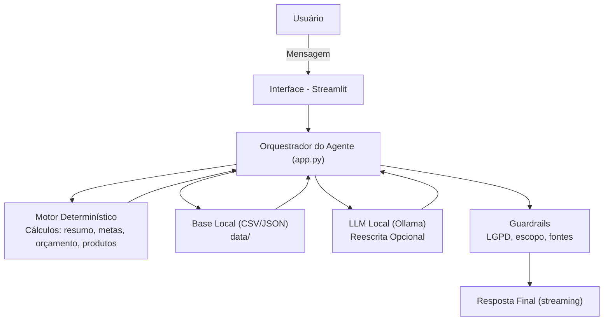

***

# Documentação do Agente - MAIA Assistente Financeira (MVP Local)

A MAIA é o agente financeiro criado para **organizar orçamento**, **gerar relatórios**, **simular metas**, **explicar produtos**, **oferecer educação financeira** e **resumir a saúde financeira do usuário**, tudo **localmente** (sem APIs externas), com **zero alucinação** e **transparência total**.

## ✨ Por que o nome é MAIA?

O nome **MAIA** foi escolhido por três razões principais: **sentido**, **sonoridade** e **personalidade do agente**.

Além disso:

**MAIA representa a ideia de uma mentora inteligente, acolhedora e voltada para autonomia financeira — um acrônimo de _Mentora de Autonomia e Inteligência Financeira_.**

Esse nome traduz perfeitamente o propósito do agente:

- apoiar sem impor,  
- ensinar sem complicar,  
- ajudar o usuário a ganhar **clareza**, **autonomia** e **segurança** nas próprias decisões.  

É simples, humano, fácil de lembrar e carrega um significado que combina com a missão do projeto.

***

# 🧩 Caso de Uso

## Problema

Muitas pessoas têm dificuldades em:

*   entender **como estão suas finanças**;
*   saber **como e onde estão gastando**;
*   identificar **padrões de despesas**;
*   saber **quanto precisam guardar** para uma reserva;
*   entender **como produtos financeiros funcionam** de forma simples.

As informações geralmente estão espalhadas, e falta um jeito **simples e seguro** de transformar esses dados em clareza.

***

## Solução

A **MAIA** analisa dados financeiros reais da pasta `data/` e responde perguntas como:

*   **“Como estão as minhas finanças?”**\
    (resumo executivo: entradas, saídas, saldo, top categorias, maior gasto, transações recentes, perfil, reserva, exemplos educativos)

*   **“Quanto gastei?”**\
    (gasto total na janela)

*   **“Quanto gastei com alimentação?”**\
    (gasto por categoria)

*   **“Qual é meu saldo?”**\
    (entradas – saídas)

*   **"Qual o meu perfil de investidor?”**

*   **"Quanto rende o produto X?”**\
    (usa somente o que está registrado em `produtos_financeiros.json`)

*   **“Onde investir?”**\
    (resposta educativa baseada no perfil, **sem recomendação** de ativo)

Tudo isso com:

*   respostas determinísticas confiáveis;
*   rodapé **Fontes** mostrando quais arquivos foram usados;
*   proteção contra temas fora do escopo;
*   recusa automática a informações sensíveis.

***

# 🧠 Como a MAIA formula respostas

A MAIA funciona com um **fluxo híbrido**:

***

## 1) Motor Determinístico (Python local) → **Fonte de Verdade**

Ele faz **todo o trabalho real**:

*   detecta intenção (regex + normalização sem acentos)
*   calcula:
    *   **entradas, saídas, saldo**
    *   **gasto total**
    *   **gasto por categoria**
    *   **maior gasto**
    *   **gasto mensal estimado**
    *   **faixa de reserva 3–6 meses**
    *   **aporte mensal** de metas
*   seleciona produtos compatíveis com **risco do perfil**
*   monta textos estruturados
*   adiciona **rodapé de Fontes**

⚠️ O determinístico **não alucina**:\
se faltar dado na base, ele diz **“Não encontrei…”**.

***

## 2) LLM Local (Ollama) — *Modo Narrador* (Opcional)

*   Só entra em ação se o usuário habilitar na sidebar.
*   **Nunca calcula nada.**
*   **Nunca altera números.**
*   Recebe apenas:
    *   **FATOS** calculados pelo motor
    *   **INSTRUÇÕES** de estilo
    *   **FONTES** que devem aparecer no final

Sua função é apenas:

> “Reescrever o texto determinístico de forma mais clara, fluida e acolhedora.”

Se o Ollama travar, o determinístico assume 100%.

***

# 🧑‍💼 Público-Alvo

*   Pessoas que querem **entender sua situação financeira**
*   Usuários iniciantes que precisam de explicações simples
*   Pessoas que não sabem por onde começar seu planejamento financeiro
*   Usuários que preferem um assistente **local e seguro** (sem internet)

***

# 🎭 Persona e Tom de Voz

## Nome do agente

**MAIA – Mentora de Autonomia e Inteligência Financeira**

## Personalidade

*   Educativa
*   Empática
*   Clara
*   Não prescritiva
*   Baseada em fatos
*   Transparente
*   Acolhedora

## Tom

*   Português natural, frases curtas
*   Sem jargões complicados
*   Sempre pode explicar o passo a passo
*   Sempre neutra (não recomenda ativos)

***

# 💬 Exemplos de Linguagem

### Saudação

> “Olá! Sou a MAIA. Quer revisar seu orçamento ou criar uma nova meta?”

### Confirmação

> “Entendido! Vou analisar suas transações da janela atual.”

### Recusa por Limitação

> “Não tenho essa informação no contexto. Posso usar seus dados da pasta `data/`.”

***

# 🏗 Arquitetura

## Diagrama

***

# ⚙️ Componentes (versão final)

| Componente                           | Papel                                                                                                 |
| ------------------------------------ | ----------------------------------------------------------------------------------------------------- |
| **Interface Streamlit**              | Chat, sidebar (LLM ON/OFF, modelo, janela de análise), histórico, diagnóstico.                        |
| **Motor Determinístico (agente.py)** | Toda a lógica: cálculos, agregações, intenções, formatação, rodapés, anti‑alucinação.                 |
| **Base Local (`data/`)**             | `transacoes.csv`, `perfil_investidor.json`, `produtos_financeiros.json`, `historico_atendimento.csv`. |
| **LLM Local (Ollama)**               | Reescrita opcional. Não altera fatos.                                                                 |
| **Guardrails**                       | LGPD, temas bloqueados, recusa a dados sensíveis, limites de escopo, rodapés obrigatórios.            |

***

# 🛡 Segurança e Anti‑Alucinação

### A MAIA segue estes princípios:

*   **Jamais cria valores** (usa apenas os dados dos CSV/JSON)
*   Se não existir a informação → **admite ausência**
*   Nunca responde sobre:
    *   clima, tempo, saúde, política, medicina
*   Proteção LGPD:
    *   nunca pede senha, token, CPF, cartão, CVV
*   Respostas sempre com **rodapé de Fontes**
*   Metas e produtos sempre com **disclaimer educativo**
*   Recomendação de investimento **nunca** é dada — apenas educação compatível por risco
*   O LLM **não pode trocar números** (recebe FATOS fechados)

***

# 🔍 Intenções que a MAIA reconhece (versão final)

### 1. Resumo Executivo → **“Como estão as minhas finanças?”**

*   Entradas, saídas, saldo
*   Top 3 categorias
*   Maior transação
*   Amostra de transações
*   Perfil + reserva 3–6 meses
*   Exemplos educativos por risco
*   Próximos passos

### 2. Gasto total → “Quanto gastei?”

### 3. Gasto por categoria → “Quanto gastei com alimentação?”

### 4. Saldo → “Qual é meu saldo?”

### 5. Maior gasto → “Qual foi o meu maior gasto?”

### 6. Recomendação educativa (compatível com perfil)

→ “Onde investir?”

### 7. “Quanto rende X?”

→ baseado no `produtos_financeiros.json`

### 8. Perfil de investidor

→ “Qual o meu perfil de investidor?”

### 9. Metas

→ “Quero juntar X em Y meses”

### 10. Produtos (listagem/explicação)

→ “Explique CDB”

### 11. Ajuda

→ “Como funciona?”

### 12. Fallback

→ Sugere perguntas úteis

***

# 🚧 Limitações

A MAIA **não faz**:

*   Previsão de mercado
*   Recomendação de ativos
*   Análise de crédito
*   Conectar-se à internet
*   Interpretar macroeconomia
*   Alucinar dados faltantes
*   Executar ordens financeiras

***

# 📌 Resumo da Arquitetura Final

1.  Usuário envia pergunta
2.  `app.py` → detecta intenção via funções do `agente.py`
3.  Motor determinístico:
    *   carrega dados
    *   calcula
    *   formata texto + fontes
4.  Se LLM ON → reescreve
5.  Streamlit mostra resposta (streaming)
6.  Guardrails garantem segurança

***
