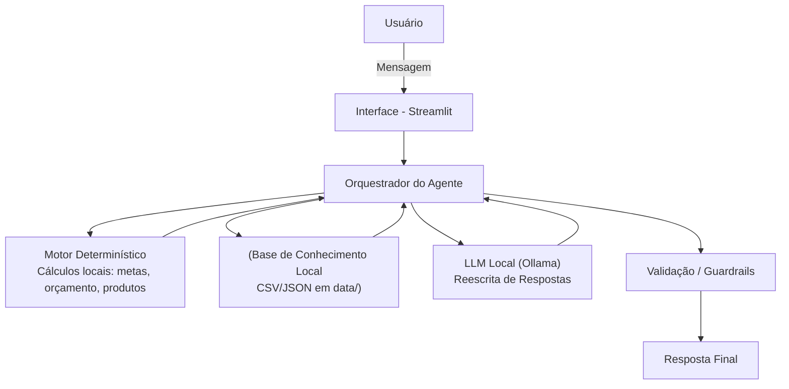

***

# Documentação do Agente

## Caso de Uso

### Problema

> Qual problema financeiro seu agente resolve?

Muitas pessoas têm dificuldade em **organizar suas finanças**, entender **para onde o dinheiro está indo** e **como alcançar metas financeiras** (ex.: viagem, quitar dívidas, reserva de emergência).\
Elas não sabem quanto precisam guardar, como ajustar o orçamento ou qual o prazo realista para atingir uma meta.\
Além disso, informações estão dispersas e o usuário não tem clareza de como transformá-las em decisões práticas.

***

### Solução

> Como o agente resolve esse problema de forma proativa?

A MAIA identifica a **intenção** do usuário (ex.: criar meta, analisar gastos, revisar orçamento), processa **dados reais da base local** e entrega:

*   **Planejamento de metas** (aporte mensal, prazo, simulações)
*   **Ajustes de orçamento** com base em padrões de consumo
*   **Alertas pontuais** (ex.: insight de **maior gasto** no período configurado)
*   **Explicações financeiras educativas**
*   **Sugestões fundamentadas em dados**, sempre com **disclaimers**

### Como a MAIA formula as respostas?

A MAIA utiliza um **fluxo híbrido**:

#### 1) **Cérebro determinístico (Python local)**

*   Detecta intenção
*   Calcula metas
*   Analisa orçamento
*   Resume produtos
*   Gera **fatos confiáveis**, por exemplo:\
    `Entrada=5000`, `Saída=2364`, `Saldo=2636`, `TopCategorias=Alimentação:450`

#### 2) **Ollama local (opcional) – “modo narrador”**

Quando ativado, o LLM recebe **exclusivamente os fatos produzidos pelo determinístico** e **reformula** a resposta em português natural, mantendo:

*   clareza
*   tom humano
*   Markdown bem formatado
*   **sem inventar dados**

Se o LLM falhar, o sistema **continua funcionando** com templates determinísticos.

***

## Público-Alvo

> Quem vai usar esse agente?

Pessoas que desejam:

*   organizar seu orçamento
*   planejar metas financeiras
*   receber orientação acessível e educativa
*   entender gastos e reduzir desperdícios
*   tomar decisões com maior segurança

Serve tanto para iniciantes quanto para usuários que precisam de acompanhamento prático.

***

## Persona e Tom de Voz

### Nome do Agente

**MAIA – Mentora de Autonomia e Inteligência Financeira**

### Personalidade (estável em ambos os modos)

*   Consultiva
*   Educativa
*   Empática
*   Objetiva
*   Transparente
*   **Baseada em fatos**
*   Jamais imperativa ou prescritiva

### Tom de Comunicação

*   Acessível, simples e profissional
*   Frases curtas
*   Jargões evitados
*   Sempre aberta a explicar com mais detalhes (**“Quer ver o passo a passo?”**)

***

## Exemplos de Linguagem

**Saudação:**

> “Olá! Sou a MAIA. Quer revisar seu orçamento ou criar uma nova meta hoje?”

**Confirmação:**

> “Entendi! Vou usar suas últimas transações para te trazer uma análise mais precisa, tudo bem?”

**Erro/Limitação:**

> “Ainda não tenho dados suficientes para isso. Posso usar sua base recente ou te mostrar um exemplo aproximado?”

***

## Arquitetura

### Diagrama

***

## Componentes

| Componente                | Papel                                                                                                                                 |
| ------------------------- | ------------------------------------------------------------------------------------------------------------------------------------- |
| **Interface (Streamlit)** | Chat com streaming de texto, indicadores “digitando…”, histórico e **menu lateral padrão (sidebar)**.                                 |
| **Motor Determinístico**  | Cuida de **toda a lógica real**: cálculos, detecção de intenção, análise de dados, formatação de fatos.                               |
| **Base de Conhecimento**  | Arquivos locais em `data/`: `transacoes.csv`, `historico_atendimento.csv`, `perfil_investidor.json`, `produtos_financeiros.json`.     |
| **LLM Local (Ollama)**    | **Opcional.** Reescreve **fatos** em texto natural. Não calcula nada. Exemplos: `mistral:7b-instruct`, `mistral:latest`, `phi3:mini`. |
| **Guardrails**            | LGPD, recusa a PII, recusa clima/saúde/assuntos fora do escopo, citações de fonte, anti‑alucinação.                                   |

***

## 🎛️ Menu Lateral (Sidebar) — Comportamento Padrão

A MAIA utiliza uma **sidebar fixa** como parte oficial do fluxo da aplicação.\
Ela controla o comportamento do agente e o recorte de dados usado nas análises.

### Componentes da Sidebar

| Componente                              | Função                                                                                                                                 |
| --------------------------------------- | -------------------------------------------------------------------------------------------------------------------------------------- |
| **Usar LLM local (Ollama)**             | Liga/desliga a reescrita por IA local. **OFF**: modo 100% determinístico.                                                              |
| **Modelo (Ollama)**                     | Escolhe o modelo local instalado (ex.: `mistral:7b-instruct`, `mistral:latest`, `phi3:mini`). Muda o tom/estilo, **não** os números.   |
| **Janela de análise (dias)**            | Define quantos dias de transações serão considerados em orçamento e **maior gasto**. Impacta **entradas, saídas, saldo e categorias**. |
| **Mostrar status dos arquivos (debug)** | Mostra se os arquivos em `data/` estão presentes/legíveis. Recurso de desenvolvimento e auditoria.                                     |
| **Ver contexto atual**                  | Exibe o contexto consolidado (perfil, metas, últimas transações, histórico e produtos) que o agente utiliza internamente.              |

**Benefícios**\
Transparência, controle sobre IA, auditabilidade e previsibilidade do comportamento.

***

## Segurança e Anti‑Alucinação

### Estratégias Adotadas

*   ✅ Respostas sempre baseadas **somente** nos dados calculados ou informados
*   ✅ LLM recebe apenas **fatos estruturados** → **não** pode inventar
*   ✅ Checagens de escopo: clima, saúde, política → **recusado** educadamente
*   ✅ LGPD total: bloqueio de senha, CPF, CVV, dados de terceiros
*   ✅ Citações obrigatórias de fonte:
    > “Fonte: `produtos_financeiros.json`”
*   ✅ Disclaimers automáticos para simulações
*   ✅ Fallback automático ao modo determinístico se o LLM falhar
*   ✅ Proteção contra prompt injection (não executa instruções perigosas)

***

## Limitações Declaradas

> O que o agente **NÃO** faz?

*   ❌ Prever rentabilidade futura
*   ❌ Recomendar investimentos
*   ❌ Executar transações financeiras
*   ❌ Acessar APIs externas online
*   ❌ Operar informações fora do escopo financeiro
*   ❌ Processar dados pessoais não fornecidos
*   ❌ Fazer análises avançadas de crédito/risco
*   ❌ Interpretar sinais de mercado ou macroeconomia

***

## Resumo Final (da arquitetura com Ollama)

A MAIA funciona assim:

1.  **Python calcula.**
2.  **Python extrai fatos e números.**
3.  **Se LLM estiver ligado:**\
    Reescreve esses fatos em texto natural → *sem alterar valores*.
4.  **Se LLM estiver desligado:**\
    Os **templates determinísticos** são exibidos.
5.  Em ambos os casos → **segurança primeiro**, sem alucinação.

***
